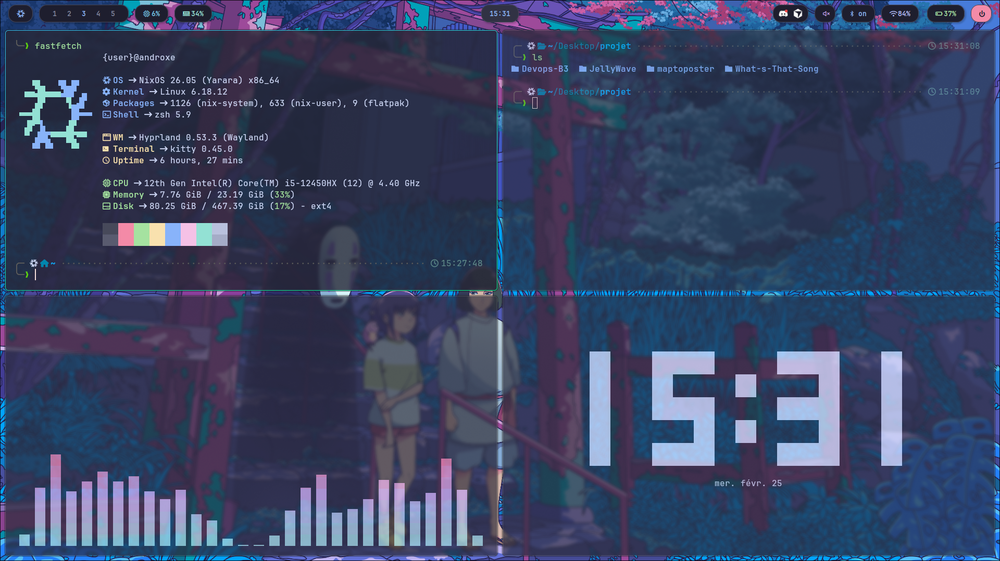
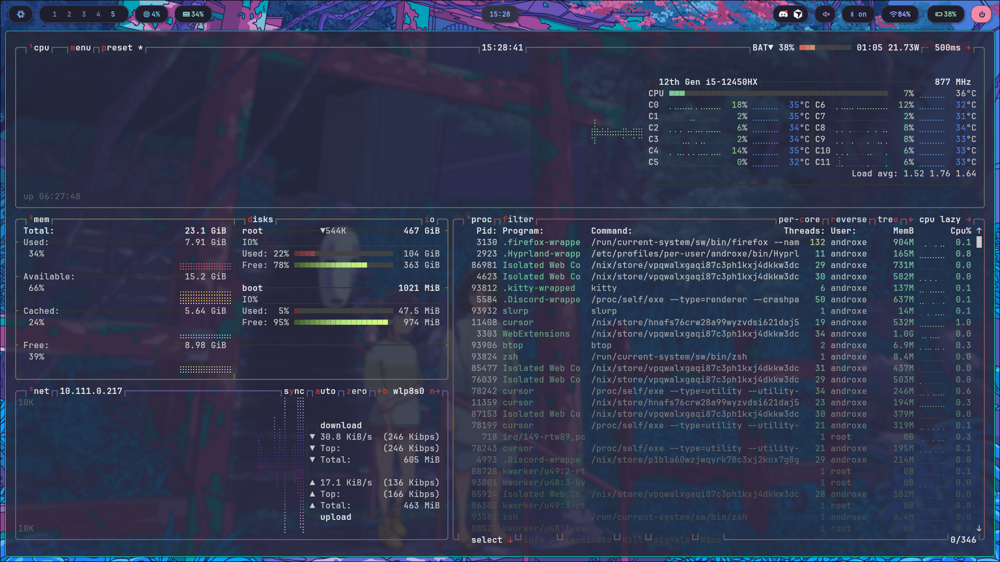
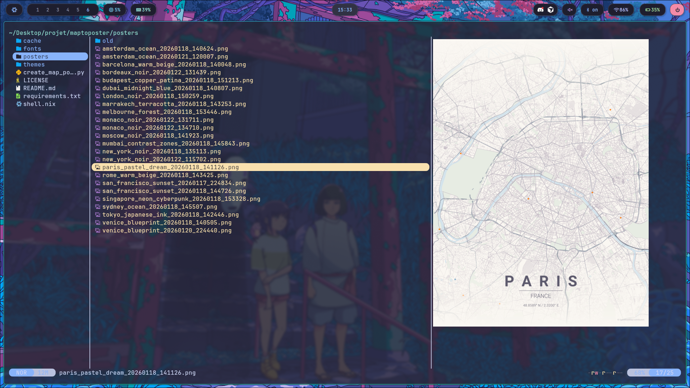

# ❄️ NixOS Config

This is my personal NixOS configuration, designed for daily use on both my desktop and laptop.

## 📸 Screenshots

## ✨ Tech Stack

* **OS:** [NixOS](https://nixos.org/)
* **Window Manager:** [Hyprland](https://hyprland.org/)
* **Terminal:** [Kitty](https://sw.kovidgoyal.net/kitty/)
* **Shell:** [Zsh](https://github.com/ohmyzsh/ohmyzsh) (currently transitioning to [Ghostty](https://ghostty.org/))
